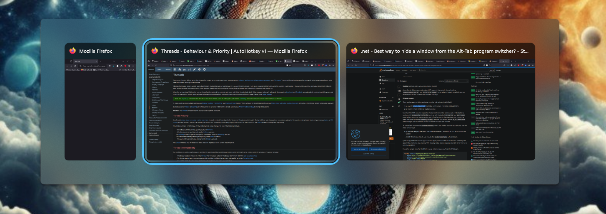
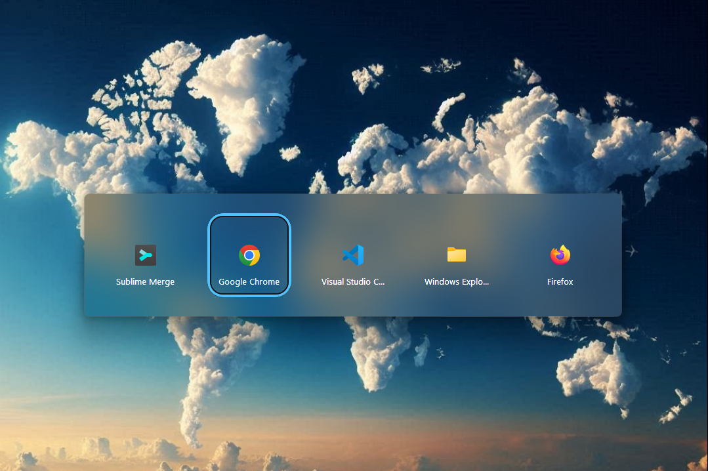

# Window Switcher + App Switcher

This small utility augments the native window switching capabilities of Windows.

It provides shortcuts found on many other operating systems, that are sorely missing from Windows.

## Features

### Window Switcher

- <kbd>Alt+`</kbd> to switch between windows of the same application
- <kbd>Shift</kbd> to cycle in reverse
- <kbd>Escape</kbd> to cancel
- ✨ Uses the native Windows window switching UI ✨
  - This means it looks and behaves exactly like the native window switcher
  - It will continue to match the Windows theme even if Microsoft overhauls their UI style

### Application Switcher

- <kbd>Win+Tab</kbd> to switch between applications
- <kbd>Shift</kbd> to cycle in reverse
- <kbd>Escape</kbd> to cancel
- Custom UI, designed to match the Windows 11 theme
  - Includes acrylic blur-behind effect
  - Skinnable by editing images in the `resources` folder

## Installation

### Window Switcher

1. Install [AutoHotkey v2](https://www.autohotkey.com/)
2. Download [`window-switcher.ahk`](window-switcher.ahk)
3. Set `window-switcher.ahk` to run on startup (see below)

### Application Switcher

1. Install [AutoHotkey v2](https://www.autohotkey.com/)
2. Download `app-switcher.ahk` and `GuiEnhancerKit.ahk` and the `resources` folder.
   The easiest way is to [download the entire repository as a zip file](https://github.com/1j01/window-switcher/archive/refs/heads/main.zip).
3. Set `app-switcher.ahk` to run on startup (see below)

### Running on Startup

- To run at startup with administrator privileges:
  - Place the script somewhere permanent, since moving or renaming it will break the startup action.
    - In the case of the app switcher, the `resources` folder must be in the same directory as the script.
  - Open Task Scheduler
  - Action > Create Task...
  - Check "Run with highest privileges" in "Security options" in General tab
  - In Triggers tab, click "New..." and set the type to "At log on"
  - For the Action, you can browse for the script.

## Known Issues

### Window Switcher

- Windows are hidden from the task bar as well, which can be distracting,
  especially with taskbar button labels enabled, as it animates the taskbar buttons collapsing and expanding.
  - ❌ I don't know of any way to hide windows from the task switcher without hiding them from the taskbar.
- Some windows are not hidden from the task switcher, such as the Task Manager, due to permission errors.
  - 🛡️✅ Running as administrator fixes this.
- UWP windows, such as Windows's Settings app, are not filtered out either.
  - ❌ They don't play well with any of the methods I've tried (`WinHide`, `WinSetExStyle`, `ITaskbarList.DeleteTab`).

### Application Switcher

- 🎨 The blur-behind effect doesn't always work. (Usually it works when triggering the app switcher a second time.)
- ⿻ Apps are not distinguished by their shortcut, so for instance, PWAs installed with Chrome will be lumped in with "Google Chrome".
- 🙈 UWP apps are not shown in the app switcher.
  - This is likely easier to solve than the issue with the window switcher, but Microsoft doesn't make it easy! They dropped the ball when it comes to compatibility when introducing UWP apps.
- Can sometimes get an error `Error: Gui has no window.` at `Pic := AppSwitcher.FocusedCtrl`
  - ❓ I don't know what caused this or if it's still a problem. If you run into this or any other issues, please let me know.

## License

This project is licensed under the MIT License - see the [LICENSE.txt](LICENSE.txt) file for details.

## TODO

I want to simplify the installation process, and the best way to do that is to compile the scripts into executables.

The window switcher works fine, but when compiling the app switcher, many issues showed up.

- Compile the scripts into executables
  - Figure out how to handle the resources needed for the app switcher (embed but allow them to be overridden with external files?)
  - Create GitHub release
  - Simplify installation instructions

- Fix app switcher issues when compiled
  - [x] 🛠️ Figure out how to embed the resources needed for the app switcher
  - [x] 🎞️ Fix memory issue with `wsprintf`
  - [ ] 🙈 Not all apps are shown (e.g. Chrome, Firefox, and VS Code are missing)
    - Apparently `WM_GETICON` is failing when compiled (returning `0`)
      - I could work around this by allowing apps to be shown without icons, but that's pretty ugly
      - I could also try to get the icon from the executable, but that's a bit more work
      - Ideally I want to get the icon from the shortcut that launched the app, but that's even more work. The taskbar does it, so it's possible.
        - [Is it possible to determine if another process/window was started using a shortcut?](https://stackoverflow.com/questions/38387860/determine-if-process-started-from-shortcut?rq=3)
          - > Yes, but not easily.
  - [ ] Script is sending Tab to itself recursively, triggering a warning message about many hotkeys being triggered in a period short time
    - Do hotkeys work differently when compiled?? Is it maybe designed to avoid responding to hotkeys originating from `AutoHotkey.exe`?
  - [ ] "Error: Gui has no window."
    - Does multithreading work differently when compiled??
    - Actually, this might be related to the Tab hotkey issue. That could explain why it's getting what appears like a timing issue. (Although I don't know for sure it's a timing issue.)
    - I might have a fix for this (3414d66940d5c43ef88884ae5298457422800721)

## Development

- The script will automatically reload if you press Ctrl+S on a window with the script's name in the title
- The [VS Code extension for AutoHotkey v2](https://marketplace.visualstudio.com/items?itemName=thqby.vscode-autohotkey2-lsp) provides auto-formatting among many other features
