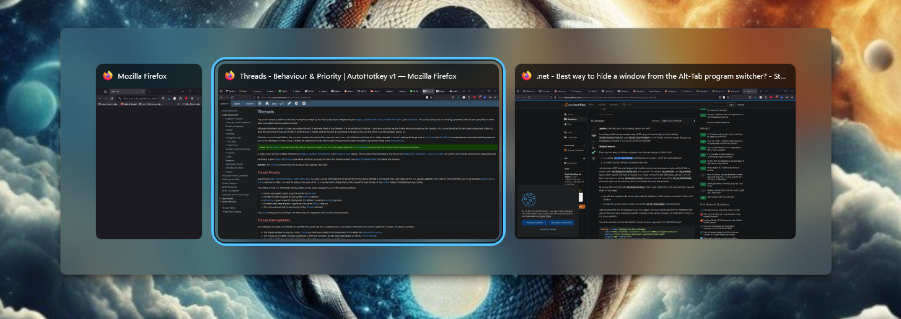
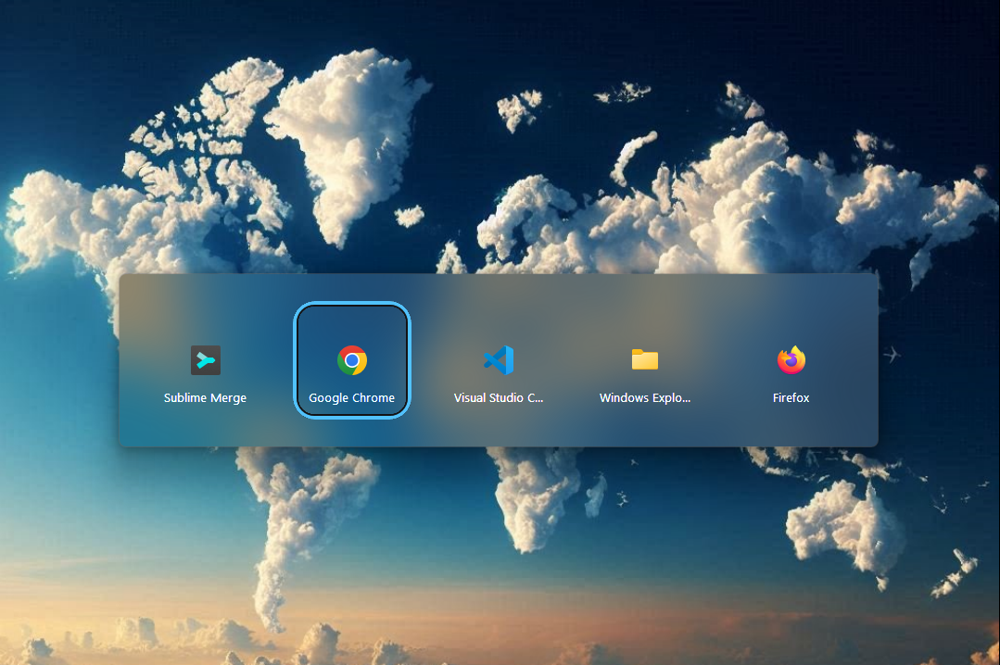

# Window Switcher + App Switcher

Tired of juggling multiple windows and apps on Windows?
Window Switcher and App Switcher are here to help. These two utilities add powerful shortcuts found in most operating systems (Ubuntu, macOS, etc.), but that are sorely missing from Windows.

Use **Window Switcher** to quickly flip between windows of the same app, and **App Switcher** to navigate between different apps.

Each utility is lightning fast, compliments each other, and integrates smoothly with the look and feel of Windows.

## Features

### Window Switcher

- <kbd>Alt+`</kbd> to switch between windows of the same application
- <kbd>Shift</kbd> to cycle in reverse
- <kbd>Escape</kbd> to cancel
- Matches windows by *logical application*, not by process
  - The windows of an installed PWA stay separate from the browser's own windows, even though they share `chrome.exe`. See [Logical applications](#logical-applications).
- ✨ Uses the native Windows window switching UI ✨
  - This means it looks and behaves exactly like the native window switcher
  - It will continue to match the Windows theme even if Microsoft overhauls their UI style

### Application Switcher

- <kbd>Alt+Tab</kbd> to switch between applications
  - Note: this replaces Windows' own <kbd>Alt+Tab</kbd> window switcher
- <kbd>Shift</kbd> to cycle in reverse
- <kbd>Escape</kbd> to cancel
- One entry per application, not one per window
  - Ten browser windows are a single entry, while each installed PWA is its own entry, with its own name and icon. See [Logical applications](#logical-applications).
- Custom UI, designed to match the Windows 11 theme
  - Includes acrylic blur-behind effect
  - Skinnable by editing images in the `resources` folder

## Installation

The two utilities are separate scripts with separate tray icons, and each works on its own.
They're designed to be used together, though, so the simplest thing is to install both.

1. Install [AutoHotkey v2](https://www.autohotkey.com/)
2. [Download the entire repository as a zip file](https://github.com/1j01/window-switcher/archive/refs/heads/main.zip) and extract it somewhere permanent.
3. Set `start-both-window-and-app-switcher.ahk` to run on startup (see below).
   It launches `app-switcher.ahk` and `window-switcher.ahk` and then exits.

If you only want one of them, the files each needs are:

| Utility | Files |
| --- | --- |
| Window Switcher | `window-switcher.ahk`, `logical-app.ahk` |
| Application Switcher | `app-switcher.ahk`, `logical-app.ahk`, `GuiEnhancerKit.ahk`, the `resources` folder |

`logical-app.ahk` is shared by both, and must sit in the same directory as the script that
includes it. (Include paths are resolved relative to the script's own folder, so the
working directory a script is launched from doesn't matter.)

You can run either script directly instead of using `start-both-window-and-app-switcher.ahk`; it's only a convenience.

### Running on Startup

- To run at startup with administrator privileges:
  - Place the scripts somewhere permanent, since moving or renaming them will break the startup action.
    - Keep the whole extracted folder together: `logical-app.ahk` must stay next to the switcher scripts, and the app switcher also needs `GuiEnhancerKit.ahk` and the `resources` folder.
  - Open Task Scheduler
  - Action > Create Task...
  - Check "Run with highest privileges" in "Security options" in General tab
  - In Triggers tab, click "New..." and set the type to "At log on"
  - For the Action, you can browse for the script.

## Logical applications

Both utilities need to answer the same question: which windows belong to the same application?

"One process" is the wrong answer. A browser spreads its windows across several processes,
and — more awkwardly — an installed PWA runs under the *same* `chrome.exe` as the browser
itself, so grouping by executable lumps Google Chat, Google Meet and Chrome together.

Windows already has an identity for this: the **Application User Model ID** (AUMID). It's what
the taskbar groups buttons by, applications publish it per-window via
`SHGetPropertyStoreForWindow` and `System.AppUserModel.ID`, and Chromium gives every installed
PWA its own. So that's what both switchers use, falling back to the executable path for windows
that don't publish one:

1. `aumid:<System.AppUserModel.ID of the window>`
2. `exe:<full path of the owning process, lowercased>`

For example, on one machine:

| Window | AUMID | Logical application |
| --- | --- | --- |
| Chrome (any number of windows) | `Chrome` | Google Chrome |
| Google Chat PWA | `Chrome._crx_pommaclcbflboakcipcmmndhcj` | Google Chat |
| Google Meet PWA | `Chrome._crx_kjgfgldnnffkjfagphfepbbdan` | Google Meet |
| VS Code | *(none)* | `exe:...\code.exe` |
| Explorer | *(none)* | `exe:c:\windows\explorer.exe` |

This is generic — nothing in the code knows about Chrome specifically — so Edge PWAs and
anything else that publishes an AUMID are separated the same way.

### Names and icons

Installed PWAs publish a distinct AUMID but, at least in Chrome's case, their windows *don't*
publish a name or icon for themselves, so they'd all be labelled "Google Chrome". The taskbar
gets its names from shortcuts, so that's where these look too. The fallback chains are:

**Name:** `System.AppUserModel.RelaunchDisplayNameResource` on the window → the name of the
Start Menu or pinned shortcut publishing the same AUMID → the executable's `FileDescription`,
then `ProductName` → the window title → the executable's filename.

**Icon:** `System.AppUserModel.RelaunchIconResource` on the window → the icon of the shortcut
publishing the same AUMID → the window's own icon → the executable's icon.

The executable's version info is preferred over the window title because window titles name the
*document*, not the application. The shortcut index is built once in the background shortly after
the app switcher starts (scanning the Start Menu takes about a second), and is refreshed at most
every five minutes when an unrecognized AUMID shows up, so newly installed apps get picked up.

### Multiple browser profiles

Chromium derives a different AUMID per profile, so windows from two Chrome profiles are treated
as two logical applications — the same way the taskbar treats them. The profile part of the AUMID
is deliberately left intact rather than stripped, since that's Windows' own notion of the
application's identity.

## How the two switchers share Alt+Tab

The application switcher takes over the physical <kbd>Alt+Tab</kbd>. The window switcher works by
*synthesizing* <kbd>Alt+Tab</kbd> to bring up the native task switcher, after hiding the windows
that don't belong to the current application. Those two facts have to be reconciled, or the
window switcher would trigger the application switcher every time.

Two mechanisms handle it:

- **Send levels.** AutoHotkey tags the keyboard input it generates with a send level, and hook
  hotkeys ignore generated input at or below their own input level. The application switcher's
  hotkeys use the `$` prefix, which forces them to be implemented with the keyboard hook — that's
  also what makes it possible to take <kbd>Alt+Tab</kbd> away from Windows in the first place. The
  window switcher sends at the default level, so its synthetic <kbd>Alt+Tab</kbd> reaches Windows
  without coming back around to the application switcher. The tag is recognized by all AutoHotkey
  builds, so this works between the two separate scripts.
  (Verified: a level-0 synthetic <kbd>Alt+Tab</kbd> opens the native switcher and never fires the
  hotkey, while a level-1 one fires the hotkey and is swallowed.)
- **A named mutex.** Send levels don't help with the *physical* <kbd>Tab</kbd> presses you make to
  cycle through the native switcher once it's open — those are indistinguishable from asking for the
  application switcher. So while the window switcher has the native switcher open, it holds a named
  mutex, and the application switcher passes <kbd>Tab</kbd> straight through instead of opening its
  own UI. The kernel releases the mutex automatically if the window switcher exits, and if only one
  of the two scripts is running the mutex simply never exists.

## Known Issues

### Window Switcher

- Windows are hidden from the task bar as well, which can be distracting,
  especially with taskbar button labels enabled, as it animates the taskbar buttons collapsing and expanding.
  - ❌ I don't know of any way to hide windows from the task switcher without hiding them from the taskbar.
- Some windows are not hidden from the task switcher, such as the Task Manager, due to permission errors.
  - 🛡️✅ Running as administrator fixes this.
- UWP windows, such as Windows's Settings app, are not filtered out either.
  - ❌ They don't play well with any of the methods I've tried (`WinHide`, `WinSetExStyle`, `ITaskbarList.DeleteTab`).

### Both

- Pressing <kbd>Alt+`</kbd> *while the application switcher is already open* isn't handled specially: the window switcher will start filtering underneath the app switcher's UI. Release <kbd>Alt</kbd> before pressing <kbd>Alt+`</kbd>.
- Windows that don't expose an AUMID are grouped by executable instead, so if an application sets one on some of its windows but not others, those windows are treated as two applications. See [Logical applications](#logical-applications).

### Application Switcher

- 🎨 The blur-behind effect doesn't always work. (Usually it works when triggering the app switcher a second time.)
- 🙈 UWP apps are not shown in the app switcher.
  - This is likely easier to solve than the issue with the window switcher, but Microsoft doesn't make it easy! They frankly dropped the ball when it comes to compatibility when introducing UWP apps.
- Can sometimes get an error `Error: Gui has no window.` at `Pic := AppSwitcher.FocusedCtrl`
  - ❓ I don't know what caused this or if it's still a problem. If you run into this or any other issues, please let me know.

## License

This project is licensed under the MIT License - see the [LICENSE.txt](LICENSE.txt) file for details.

## TODO

I want to simplify the installation process, and the best way to do that is to compile the scripts into executables.

The window switcher works fine, but when compiling the app switcher, many issues showed up.

It's unfortunate, since the app switcher is the one that has dependencies that I want to bundle to simplify installation.

- [ ] Get app switcher working when compiled into `app-switcher.exe`
  - [x] Figure out how to embed the resources
    - `FileInstall` is a nice built in mechanism for this.
    - (Might want to support overriding resources by placing them in the same directory as the executable (or in a subdirectory alongside it), or via a config file...)
  - [x] Fix app crashing, usually silently but occasionally showing an "critical error" message with very little information
    - Narrowed it down to a memory issue with `wsprintf` where it would write a null terminator past the end of the buffer
  - [ ] 🙈 Not all apps are shown (e.g. Chrome, Firefox, and VS Code are missing)
    - Apparently `WM_GETICON` is failing when compiled (returning `0`)
      - This may be fixed now: icons are looked up from the app model / shortcut / executable before falling back to `WM_GETICON`, so a window that reports no icon of its own can still be shown. Worth re-testing when compiled.
      - [Is it possible to determine if another process/window was started using a shortcut?](https://stackoverflow.com/questions/38387860/determine-if-process-started-from-shortcut?rq=3)
        - > Yes, but not easily.
        - Resolved a different way: shortcuts are matched to windows by AUMID rather than by figuring out what launched a process. See [Logical applications](#logical-applications).
  - [ ] Script is sending Tab to itself recursively, triggering a warning message about many hotkeys being triggered in a period short time
    - Do hotkeys work differently when compiled?? Is it maybe designed to avoid responding to hotkeys originating from `AutoHotkey.exe`?
  - [ ] "Error: Gui has no window."
    - Does multithreading work differently when compiled??
    - Actually, this might be related to the Tab hotkey issue. That could explain why it's getting what appears like a timing issue. (Although I don't know for sure it's a timing issue.)
    - I might have a fix for this (3414d66940d5c43ef88884ae5298457422800721)
- [ ] Create GitHub release
- [ ] Simplify installation instructions
- [ ] Customize tray icon for app switcher (window switcher already has an appropriate icon from shell32.dll, although it could be improved)

## Development

- The script will automatically reload if you press Ctrl+S on a window with the script's name in the title
- The [VS Code extension for AutoHotkey v2](https://marketplace.visualstudio.com/items?itemName=thqby.vscode-autohotkey2-lsp) provides auto-formatting among many other features
